Nucleotide Diversity
================
brendanlahm
1/12/2021

``` r
### Nucleotide Diversity (pi)

wpi36 = read.table("C:/Users/bml99/OneDrive/Documents/R/2020/pi/SNPs4_thinned.windowed.pi", header =T)
wpi36_pi = read.table("C:/Users/bml99/OneDrive/Documents/R/2020/pi/SNPs4_pi.windowed.pi", header =T)
wpi_A = read.table("C:/Users/bml99/OneDrive/Documents/R/2020/pi/Location_A.windowed.pi", header =T)
wpi_EA = read.table("C:/Users/bml99/OneDrive/Documents/R/2020/pi/Location_EA.windowed.pi", header =T)
wpi_L1a = read.table("C:/Users/bml99/OneDrive/Documents/R/2020/pi/Location_L1a.windowed.pi", header =T)
wpi_L1b = read.table("C:/Users/bml99/OneDrive/Documents/R/2020/pi/Location_L1b.windowed.pi", header =T)
wpi_L3 = read.table("C:/Users/bml99/OneDrive/Documents/R/2020/pi/Location_L3.windowed.pi", header =T)
wpi_L6 = read.table("C:/Users/bml99/OneDrive/Documents/R/2020/pi/Location_L6.windowed.pi", header =T)
wpi_L7 = read.table("C:/Users/bml99/OneDrive/Documents/R/2020/pi/Location_L7.windowed.pi", header =T)
wpi_L8 = read.table("C:/Users/bml99/OneDrive/Documents/R/2020/pi/Location_L8.windowed.pi", header =T)
wpi_L11 = read.table("C:/Users/bml99/OneDrive/Documents/R/2020/pi/Location_L11.windowed.pi", header =T)


############# Plotting across the genome for 36 isolates

library(ggplot2)

m36_pi <- mean(wpi36_pi$PI)

e <- ggplot(wpi36_pi, aes(x=BIN_START, y=PI)) + theme_bw() + ylab("Pi") + xlab("Position") + 
  theme(axis.text.x = element_text(size=14), axis.title.x = element_blank(), axis.text.y = element_text(size=14), axis.title.y = element_blank())
e <- e+geom_point() + geom_smooth(method = "loess", se = FALSE, span = 1/10)
e
```

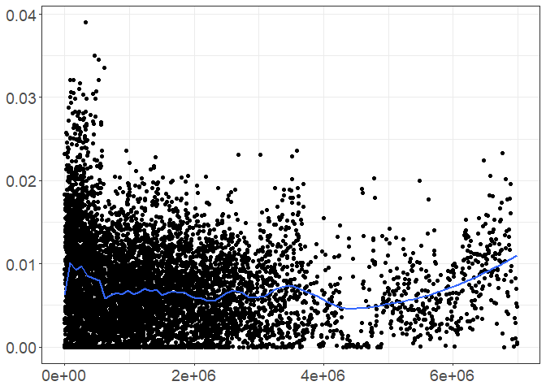<!-- -->

``` r
##### Now for each location

## Location A

m36_A <- mean(wpi_A$PI)

f <- ggplot(wpi_A, aes(x=BIN_START, y=PI)) + theme_bw() + ylab("Pi") + xlab("Position") + 
  theme(axis.text.x = element_text(size=14), axis.title.x = element_blank(), axis.text.y = element_text(size=14), axis.title.y = element_blank())
f <- f+geom_point() + geom_smooth(method = "loess", se = FALSE, span = 1/10)
f
```

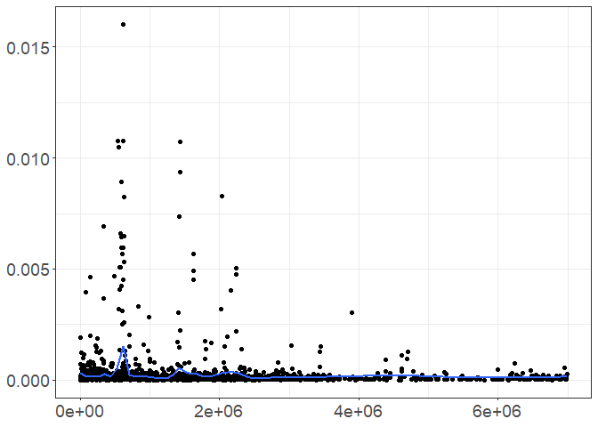<!-- -->

``` r
## Location EA

m36_EA <- mean(wpi_EA$PI)

g <- ggplot(wpi_EA, aes(x=BIN_START, y=PI)) + theme_bw() + ylab("Pi") + xlab("Position") + 
  theme(axis.text.x = element_text(size=14), axis.title.x = element_blank(), axis.text.y = element_text(size=14), axis.title.y = element_blank())
g <- g+geom_point() + geom_smooth(method = "loess", se = FALSE, span = 1/10)
g
```

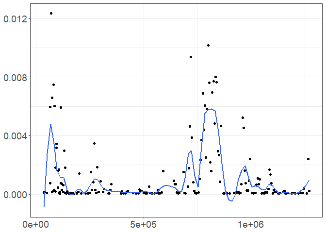<!-- -->

``` r
## Location L1a

m36_L1a <- mean(wpi_L1a$PI)

h <- ggplot(wpi_L1a, aes(x=BIN_START, y=PI)) + theme_bw() + ylab("Pi") + xlab("Position") + 
  theme(axis.text.x = element_text(size=14), axis.title.x = element_blank(), axis.text.y = element_text(size=14), axis.title.y = element_blank())
h <- h+geom_point() + geom_smooth(method = "loess", se = FALSE, span = 1/10)
h
```

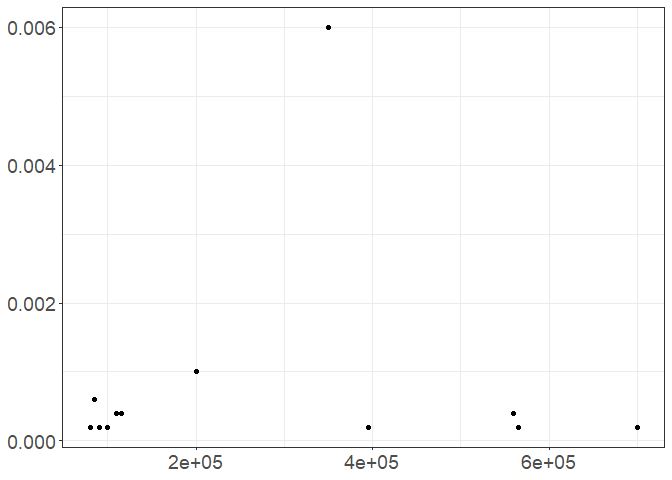<!-- -->

``` r
## Location L1b

m36_L1b <- mean(wpi_L1b$PI)

i <- ggplot(wpi_L1b, aes(x=BIN_START, y=PI)) + theme_bw() + ylab("Pi") + xlab("Position") + 
  theme(axis.text.x = element_text(size=14), axis.title.x = element_blank(), axis.text.y = element_text(size=14), axis.title.y = element_blank())
i <- i+geom_point() + geom_smooth(method = "loess", se = FALSE, span = 1/10)
i
```

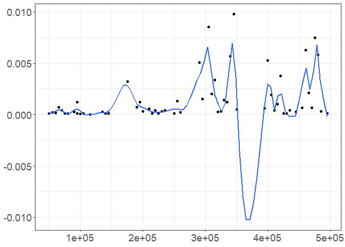<!-- -->

``` r
## Location L3

m36_L3 <- mean(wpi_L3$PI)

j <- ggplot(wpi_L3, aes(x=BIN_START, y=PI)) + theme_bw() + ylab("Pi") + xlab("Position") + 
  theme(axis.text.x = element_text(size=14), axis.title.x = element_blank(), axis.text.y = element_text(size=14), axis.title.y = element_blank())
j <- j+geom_point() + geom_smooth(method = "loess", se = FALSE, span = 1/10)
j
```

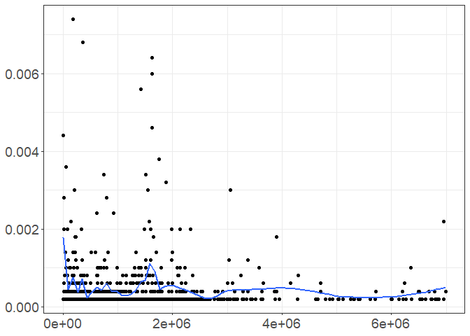<!-- -->

``` r
## Location L6

m36_L6 <- mean(wpi_L6$PI)

k <- ggplot(wpi_L6, aes(x=BIN_START, y=PI)) + theme_bw() + ylab("Pi") + xlab("Position") + 
  theme(axis.text.x = element_text(size=14), axis.title.x = element_blank(), axis.text.y = element_text(size=14), axis.title.y = element_blank())
k <- k+geom_point() + geom_smooth(method = "loess", se = FALSE, span = 1/10)
k
```

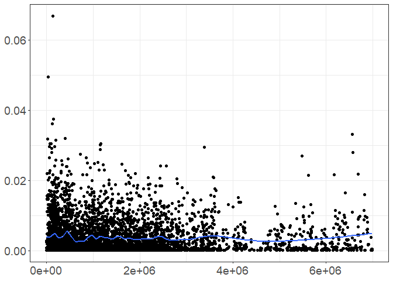<!-- -->

``` r
## Location L7

m36_L7 <- mean(wpi_L7$PI)

l <- ggplot(wpi_L7, aes(x=BIN_START, y=PI)) + theme_bw() + ylab("Pi") + xlab("Position") + 
  theme(axis.text.x = element_text(size=14), axis.title.x = element_blank(), axis.text.y = element_text(size=14), axis.title.y = element_blank())
l <- l+geom_point() + geom_smooth(method = "loess", se = FALSE, span = 1/10)
l
```

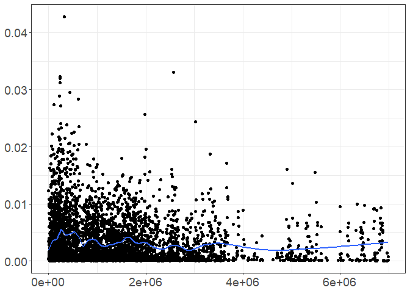<!-- -->

``` r
## Location L8

m36_L8 <- mean(wpi_L8$PI)

m <- ggplot(wpi_L8, aes(x=BIN_START, y=PI)) + theme_bw() + ylab("Pi") + xlab("Position") + 
  theme(axis.text.x = element_text(size=14), axis.title.x = element_blank(), axis.text.y = element_text(size=14), axis.title.y = element_blank())
m <- m+geom_point() + geom_smooth(method = "loess", se = FALSE, span = 1/10)
m
```

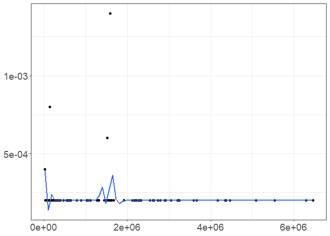<!-- -->

``` r
## Location L11

m36_L11 <- mean(wpi_L11$PI)

n <- ggplot(wpi_L11, aes(x=BIN_START, y=PI)) + theme_bw() + ylab("Pi") + xlab("Position") + 
  theme(axis.text.x = element_text(size=14), axis.title.x = element_blank(), axis.text.y = element_text(size=14), axis.title.y = element_blank())
n <- n+geom_point() + geom_smooth(method = "loess", se = FALSE, span = 1/10)
n
```

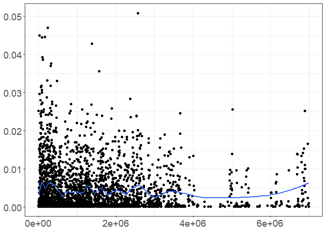<!-- -->

``` r
########## Plotting means for each location

locations = read.csv("C:/Users/bml99/OneDrive/Documents/R/2020/pi/Pi_locations.csv", header = T, sep = ",", na.strings = "")

locations$Location = factor(locations$Location, levels=c('A','EA','L1a','L1b','L3', 'L6','L7','L8','L11'))

o <- ggplot(locations, aes(x=Location, y=Pi, color=Location, shape=Host)) + theme_bw() + ylab("Pi") + xlab("Location") + 
  theme(axis.text.x = element_text(size=14), axis.title.x = element_blank(), axis.text.y = element_text(size=14), axis.title.y = element_blank()) +
  scale_color_manual(values=c("#E69F00", "#56B4E9", "#66FFCC", "#66FF33", "#66CC00", "#009900", "#FF6666", "#CC00FF", "#CC0033"))
o <- o+geom_point(size=5)
o
```

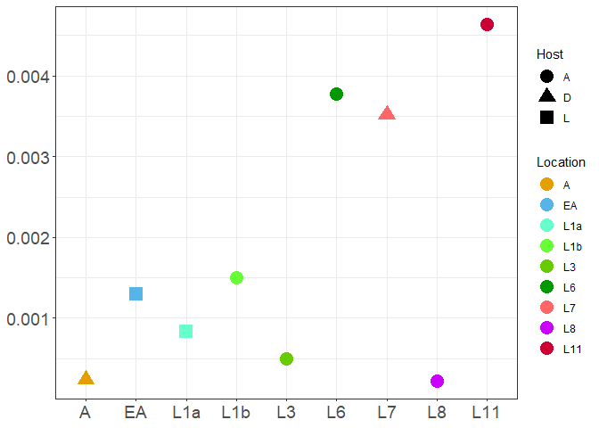<!-- -->

``` r
## SNP counts for each location

p <- ggplot(locations, aes(x=Location, y=SNP.count, color=Location, shape=Host)) + theme_bw() + ylab("SNP count") + xlab("Location") + 
  theme(axis.text.x = element_text(size=14), axis.title.x = element_blank(), axis.text.y = element_text(size=14), axis.title.y = element_blank()) +
  scale_color_manual(values=c("#E69F00", "#56B4E9", "#66FFCC", "#66FF33", "#66CC00", "#009900", "#FF6666", "#CC00FF", "#CC0033"))
p <- p+geom_point(size=5)
p
```

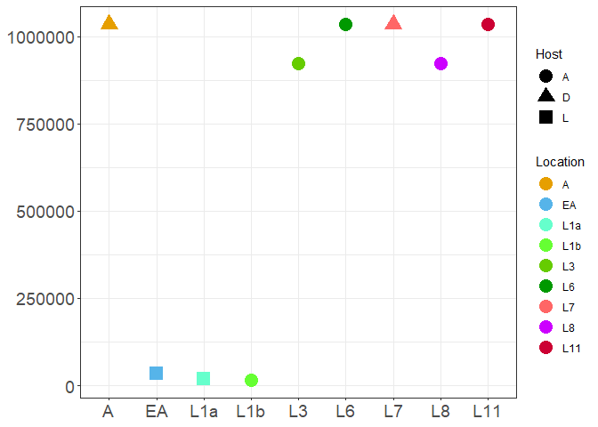<!-- -->
