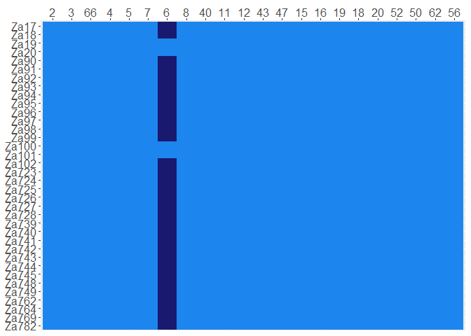
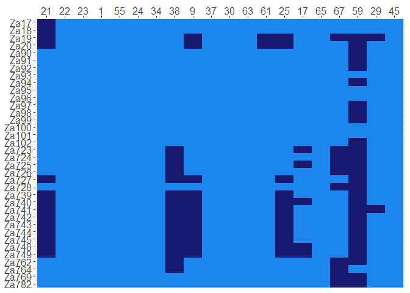
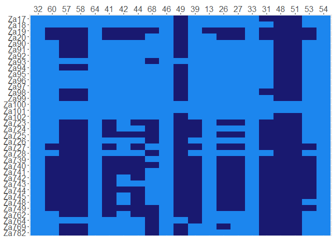

PAV
================
brendanlahm
1/12/2021

``` r
###### PAV heatmaps for 36 isolates mapped to Za100

### These csv files just contain a bunch of ones and zeros showing PAV of Za100 contigs

isolates36 = read.csv("C:/Users/bml99/OneDrive/Documents/R/2020/PAV_isolates36.csv", header = T, sep = ",", na.strings = "")
contigs36 <- read.csv("C:/Users/bml99/OneDrive/Documents/R/2020/PAV_contigs36.csv", header = T, sep = ",", na.strings = "")
contigs36$Contig <- as.character(as.numeric(contigs36$Contig))


### Creating the vectors to be used as labels & initial data frame

library(reshape2)

CON36 <- as.vector(contigs36$Contig)
ISO36 <- as.vector(isolates36$Isolate)

PAV36 = read.csv("C:/Users/bml99/OneDrive/Documents/R/2020/PAV36.csv", header = T,  col.names = CON36, sep = ",", na.strings = "")
PAV36_2 <- as.data.frame(t(PAV36))

row.names(PAV36_2) <- CON36
PAV36_3 <- melt(PAV36_2)

data36 <- expand.grid(X=CON36, Y=ISO36)
data36_2 <- data.frame (data36, PAV36_3$value)


### Setting up the data frame to account for the labels in the plot

library(dplyr)

data36_2 <- data36_2 %>%
  mutate(text = paste0("x: ", X, "\n", "y: ", Y, "\n", "Value: ",round(PAV36_3$value,2), "\n", "What else?"))

colnames(data36_2)[3] <- "Z"


## Subsetting for specific contigs & plotting

# Contigs were split up 3 ways but were kept in order of decreasing size

library(ggplot2)

data36_3 <- data36_2[data36_2$X %in% c(2,3,66, 4, 5, 7, 6, 8, 40, 11, 12, 43, 47, 15, 16, 19, 18, 20, 52, 50, 62, 56), ]

r <- ggplot(data36_3, aes(X, Y, fill= Z, text=text)) +
  geom_tile() + scale_x_discrete(position = "top") + scale_y_discrete(limits = rev(levels(data36_2$Y))) +
  scale_fill_gradient(low="midnightblue", high="dodgerblue2") + theme(legend.position = "none", axis.title.x = element_blank(), axis.title.y = element_blank(),
        axis.text.x = element_text(size=12), axis.text.y = element_text(size=12))
r
```

<!-- -->

``` r
data36_4 <- data36_2[data36_2$X %in% c(21, 22, 23, 1, 55, 24, 34, 38, 9, 37, 30, 63, 61, 25, 17, 65, 67, 59, 29, 45), ]

s <- ggplot(data36_4, aes(X, Y, fill= Z, text=text)) +
  geom_tile() + scale_x_discrete(position = "top") + scale_y_discrete(limits = rev(levels(data36_2$Y))) +
  scale_fill_gradient(low="midnightblue", high="dodgerblue2") + theme(legend.position = "none", axis.title.x = element_blank(), axis.title.y = element_blank(),
                                                                      axis.text.x = element_text(size=12), axis.text.y = element_text(size=12))
s
```

<!-- -->

``` r
data36_5 <- data36_2[data36_2$X %in% c(32, 60, 57, 58, 64, 41, 42, 44, 68, 46, 49, 39, 13, 26, 27, 33, 31, 48, 51, 53, 54), ]

t <- ggplot(data36_5, aes(X, Y, fill= Z, text=text)) +
  geom_tile() + scale_x_discrete(position = "top") + scale_y_discrete(limits = rev(levels(data36_2$Y))) +
  scale_fill_gradient(low="midnightblue", high="dodgerblue2") + theme(legend.position = "none", axis.title.x = element_blank(), axis.title.y = element_blank(),
                                                                      axis.text.x = element_text(size=12), axis.text.y = element_text(size=12))
t
```

<!-- -->
